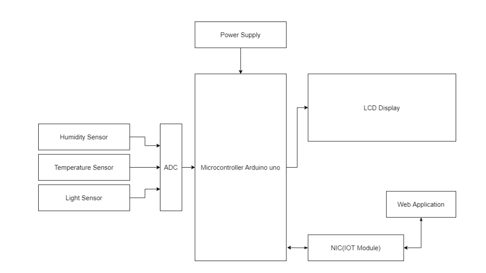
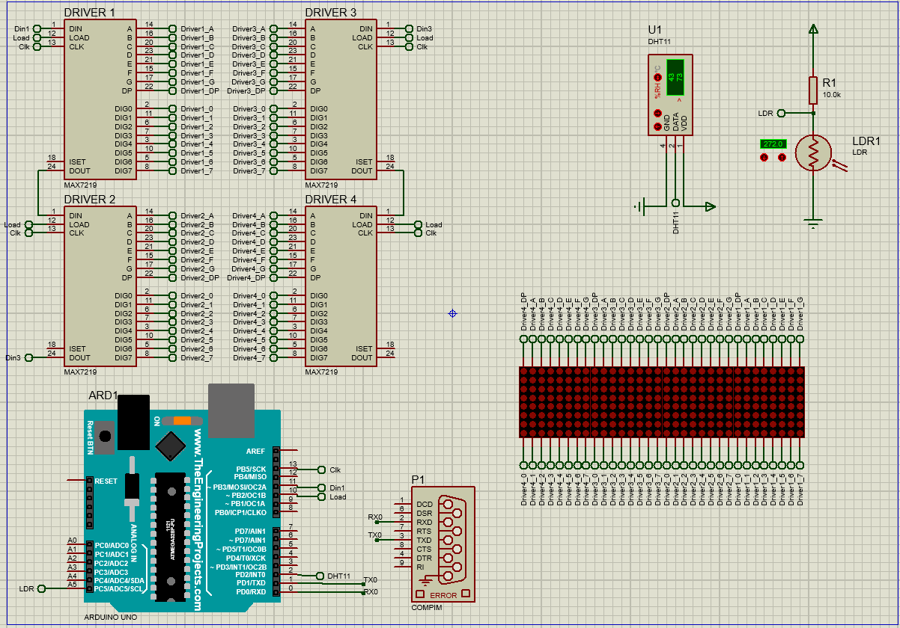

# Embedded Systems Final Project
This repository contains an implementation of an IoT project that measures environment parameters like temperature, humidity and light density and display them on a led moving sign.

This repo also includes Arduino code for client/server and source code of the web interface.

