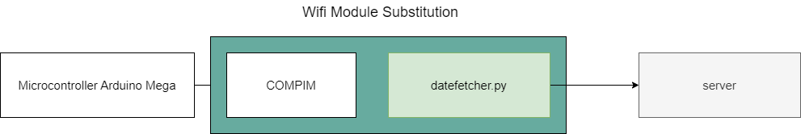

# Embedded Systems Final Project
This repository contains an implementation of an IoT project that measures environment parameters like temperature, humidity and light density and display them on a led moving sign.

This repo also includes Arduino code for client/server and source code of the web interface.

# COM Port
Wifi module is not available in Proteus currently, so we decided to use a virtual COM port to make a connection between microcontroller and server.

## Getting Started

1. Install [Serial to Ethernet Connector](https://dl.downloadly.ir/Files/Software2/Eltima_Software_Serial_to_Ethernet_Connector_7.1.876_Downloadly.ir.rar)
2. Create a client connection and select COM1, add remote host entry with these parameters
    - **Remote host name:** localhost
    - **Port:** 5001
  
3. Run `datefetcher.py` script
4. Open `Final Project.pdsprj` and start simulation